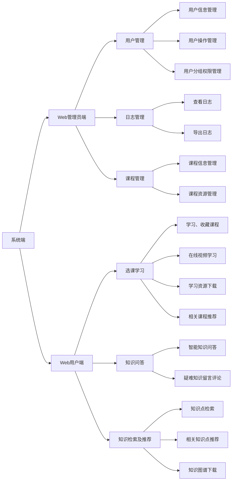

```mermaid
graph LR
root[系统端]
a[Web管理员端]
b[Web用户端]
root-->a
root-->b

a1[用户管理]
a2[日志管理]
a3[课程管理]
a-->a1
a-->a2
a-->a3

a11[用户信息管理]
a12[用户操作管理]
a13[用户分组权限管理]
a1-->a11
a1-->a12
a1-->a13

a21[查看日志]
a22[导出日志]
a2-->a21
a2-->a22

a31[课程信息管理]
a32[课程资源管理]
a3-->a31
a3-->a32

b1[选课学习]
b2[知识问答]
b3[知识检索及推荐]
b-->b1
b-->b2
b-->b3

b11[学习、收藏课程]
b12[在线视频学习]
b13[学习资源下载]
b14[相关课程推荐]
b1-->b11
b1-->b12
b1-->b13
b1-->b14

b21[智能知识问答]
b22[疑难知识留言评论]
b2-->b21
b2-->b22

b31[知识点检索]
b32[相关知识点推荐]
b33[知识图谱下载]
b3-->b31
b3-->b32
b3-->b33
```

